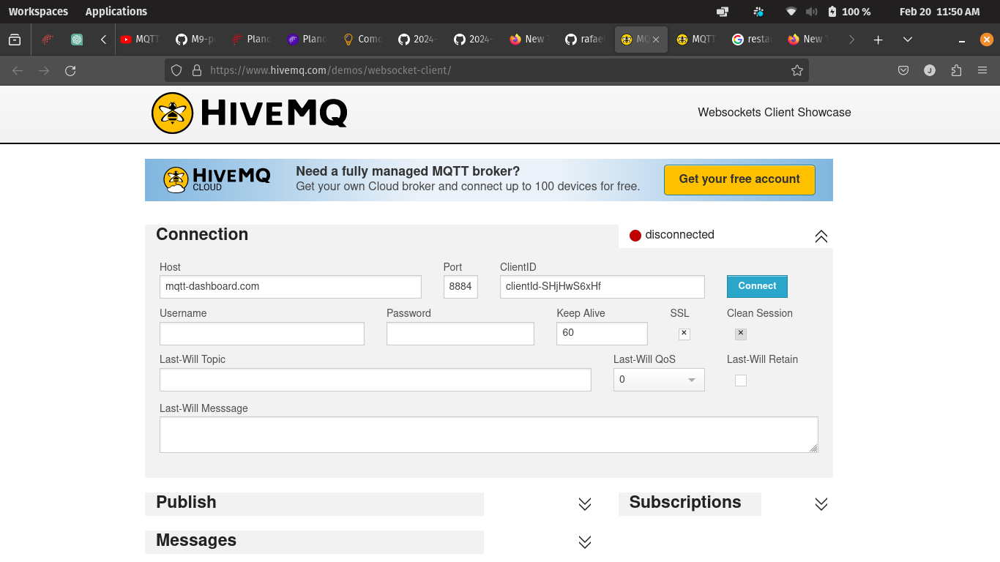

# Respostas às perguntas no roteiro do encontro de Security

## 1. O que acontece se você utilizar o mesmo ClientID em outra máquina ou sessão do browser?
    
R: A primeira máquina ou sessão do browser conectado é desconectado da sessão com o mesmo ClientID.

## 2. Algum pilar do CIA Triad é violado com isso?

R: Sim, ao permitir que um mesmo ClientID tente se conectar a diferentes brokers simultaneamente, de forma que compromete as conexões, o princípio de Integridade está sendo violado. Isso ocorre, pois a integridade dos dados pode ser comprometida quando há essa tentativa de múltiplas conexões com o mesmo ClientID resultando em inconsistências nos dados ou no sistema.

## 3. Com os parâmetros de `resources` no arquivo docker-compose, algum pilar do CIA Triad pode ser facilmente violado?

R: Com os parâmetros `cpus` e `memory` definidos no serviço MQTT, é possível violar o pilar de Disponibilidade ou Availability, pois nesses parâmetros são definidos limites baixos para CPU e memória, e dessa forma o risco de comprometer a disponibilidade do serviço MQTT é aumentado. Caso os recursos forem insuficientes para atender à demanda do aplicativo, ou seja, se aplicação exceder os limites definidos, ela pode ficar inoperante ou responder lentamente.

## 4. Sem autenticação (repare que a variável allow_anonymous em mosquitto.conf está como true), como a parte de confidencialidade pode ser violada?

R: A confidencialidade pode ser violada de algumas maneiras, começando pela Intercepção de mensagens, ou seja, qualquer pessoa pode se conectar ao broker e se inscrever em tópicos para interceptar mensagens. Publicação de mensagens não autorizadas, ou seja, os clientes podem publicas mensagens em tópicos que não são autorizados. Também pela manipulação de tópicos, ou seja quando clientes não autorizados podem tentar manipular tópicos em que publicam ou em que estão inscritos para acessar informações confidenciais.

## Evidências de realização dos testes propostos:

.png)
.png)
